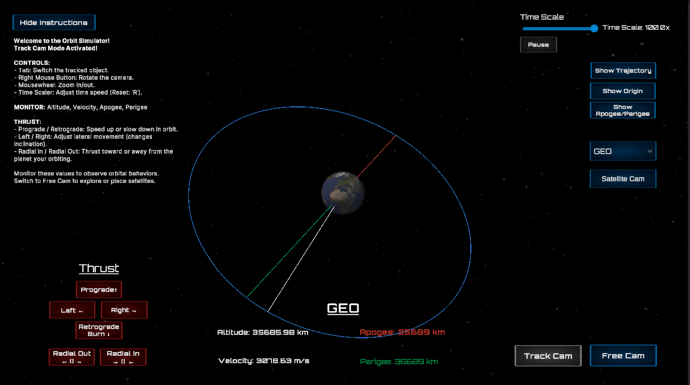
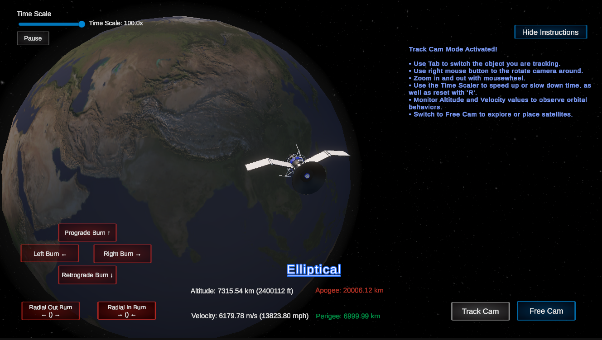

# Satellite Maneuver Simulator Prototype  

An interactive, real-time N-body orbital physics simulator built in Unity, now enhanced with a C++ DLL for improved physics performance. This project features RK4 numerical integration, GPU-accelerated trajectory rendering, and real-time thrust mechanics.

## Motivation
I got into this from watching SpaceX launches and being fascinated by booster landings. That got me interested in orbital mechanics and how we maneuver satellites. I wanted to build a simulator where I could both deepen my understanding of the physics and show my technical skills, not just as a software developer but as someone aiming for a career in simulation engineering. Along the way, this project led me to explore GMAT, where I learned a lot about delta-v, transfer orbits, and mission planning, which reinforced my interest in space simulation and has been helpful for validating my own work. This has been a hands-on way to dive into real-time physics, complex systems, and simulation development.

[Watch the Demo Video](https://www.youtube.com/watch?v=aADKGJIdwKM) *Cntl-click to open in new tab*




_Current state of the simulation. Top image shows the Track cam from a distance with current object you are tracking, showing orbit path, origin/ground path line, and apogee/perigee lines. The second image is Track cam up close showing the Satellite model. The third image shows Free cam where you can move around freely and place new satellites! Work in progress._

## Table of Contents
- [Overview](#overview)
- [Key Features](#key-features)
- [Orbital Accuracy Validation](#orbital-accuracy-validation)
- [How It Works](#how-it-works)
- [How to Use](#how-to-use)
- [Planned Features](#planned-features)
- [Limitations](#limitations)
- [Getting Started](#getting-started)
- [Technical Physics Breakdown](./NBODY_PHYSICS_RK4.md) *(separate file for RK4 and gravity calculations)*

---

## Overview
This project is a real-time orbital mechanics simulator that allows users to visualize, manipulate, and experiment with accurate gravitational physics. It includes fully interactive thrust mechanics, trajectory predictions, and scalable time controls to demonstrate how small adjustments affect long-term orbits.

Built in Unity, it uses Runge-Kutta 4th Order (RK4) integration for accuracy and GPU acceleration for smooth trajectory rendering. Core physics calculations are offloaded to a **C++ DLL**, significantly improving performance.

---

## Key Features

### Real-Time N-Body Simulation
- Newtonian gravity with all celestial bodies affecting each other dynamically.
- RK4 numerical integration ensures long-term orbital stability.
- Earth remains stationary, but objects like the Moon and satellites interact.

### Performance Optimization
- **C++ DLL Integration:** Handles core physics calculations, reducing CPU load.
- **GPU-Accelerated Trajectories:** Offloads visualization to the GPU for better performance.

### Orbital Maneuvering & Thrust Mechanics
- Prograde, retrograde, radial, and lateral burns for orbit adjustments.
- Realistic mass-based thrust scaling.
- Dynamic computation of apogee, perigee, and orbital period.

### Camera & Visualization
- **Track Camera:** Follow a selected object with live velocity and altitude readouts.
- **Free Camera:** Move freely, place new objects, and analyze orbits.

### Time Control & Scaling
- Adjust time scale (**1x to 100x**).
- Pause and resume without resetting orbits.

---

### **Orbital Accuracy Validation**
- The RK4 numerical integration method ensures highly stable and precise orbits.
- Orbital periods match theoretical Keplerian calculations within **99.98% accuracy**.
- **Tested orbital configurations (no atmospheric drag applied):**
  - **Low Earth Orbit (LEO):** Circular orbit at **408.773 km altitude**, expected period **92.74 min**, measured **92.616 min**.
  - **Elliptical Orbit:** **Perigee 7,000 km**, **Apogee 20,007 km**, expected period **7.75 hours**, measured **7.88 hours**.

| Orbit Type  | Expected Period | Measured Period | Accuracy |
|------------|----------------|----------------|----------|
| Circular - 408.8km Altitude | 92.74 min | 92.616 min | 99.87% |
| Elliptical – 7,000 km Perigee / 20,007 km Apogee | 7.75 hrs | 7.88 hrs | 99.98% |

These results were determined through **direct in-simulation timing** using a high-speed time scale and manual stopwatch measurements. Future iterations may incorporate additional perturbation forces (e.g., atmospheric drag, J2 oblateness), but for now, this remains a purely Newtonian N-body simulation.

---

## How It Works  
*(For in-depth equations and derivations, see [NBody_Physics_RK4.md](./NBODY_PHYSICS_RK4.md))*

### Numerical Integration (RK4)
- Uses Runge-Kutta 4th Order (RK4) instead of Euler for better stability.
- Computes position and velocity updates using four derivative calculations per step.
- Prevents numerical drift, keeping orbits stable over long simulations.

### C++ Physics Module
- The core gravitational and RK4 physics logic is handled by a C++ DLL.
- Unity calls native C++ functions through the `NativePhysics` wrapper, enhancing performance.
- Avoids performance bottlenecks by processing large arrays and vector operations natively.

### Gravity Calculations
- Uses Newton’s Law of Gravitation to compute forces between all objects:
```
 F = G * (m1 * m2) / r^2 
```
- Avoids singularities by applying minimum distance thresholds.

---

## How to Use  

### Track Camera Mode
- Switch Tracked Object: Use the **dropdown menu** to select the object you want to track.
- Camera Controls: Right mouse button to rotate, scroll wheel to zoom.
- View Real-Time Data: Velocity (m/s and mph) and altitude (km and ft).
- **Earth Cam Button**: Toggles between two camera modes:
  - **Earth Cam**: Centers the view on Earth, making it easier to observe satellite orbits around the planet.
  - **Satellite Cam**: Centers the view on the selected satellite, following it as it moves around Earth.

### Free Camera Mode
- Move with `WASD` or arrow keys, rotate with right-click, zoom with scroll wheel.
- Place New Planets: Set mass, radius, and velocity dynamically.

### Thrust Controls
- `Prograde Burn ↑` - Increase orbital speed.
- `Retrograde Burn ↓` - Decrease orbital speed.
- `Radial In/Out` - Modify altitude.
- `Lateral Burns` - Change inclination.

### Time Scaling
- Adjust with the slider (1x to 100x).
- Press `R` to reset time to normal speed.

---

## Planned Features  

- Maneuver Planning System - Pre-plan orbital burns similar to Kerbal Space Program.
- Full N-Body Simulation (Moving Earth) - Allow Earth to respond dynamically to forces.
- Barnes-Hut Optimization - Improve N-body calculations for better performance.
- Fuel System and Delta-V Calculations - Limit thrust by fuel mass, making burns more strategic.

---

## Limitations
- **No Aerodynamic Effects**: Currently, there’s no atmosphere or drag modeling.
- **No Relativistic Corrections**: Strictly Newtonian physics—relativistic effects are not accounted for.
- **Simplified Collisions**: Bodies are removed rather than merged; no physical collision response.
- **Prototype Thrust**: Thrust controls are still basic. More detailed burn planning is not yet implemented.

## Status

The core physics engine now utilizes a C++ DLL to improve computational performance and stability. Visual improvements and advanced feature development are ongoing.

## Getting Started

### Prerequisites

- **Unity:** Ensure you have Unity installed (version 2020.3 or later recommended).
- **Git:** For version control and cloning the repository.

### Installation

1. **Clone the Repository:**

- HTTPS:
  ```bash
  git clone https://github.com/Brprb08/space-orbit-simulation.git
  ```
- SSH:
  ```
  git clone git@github.com:Brprb08/space-orbit-simulation.git
  ```
- Github CLI:
  ```
  gh repo clone Brprb08/space-orbit-simulation
  ```

2. **Open in Unity:**

- Launch Unity Hub.
- Click on `Add` and navigate to the cloned repository folder.
- Open the project.

2. **Run the Simulation:**

- Open the `OrbitSimulation.unity` file located in the `Assets/Scenes` directory.
- If no hierarchy or GameObjects are visible, ensure you have opened the correct scene by double-clicking `OrbitSimulation.unity`.
- Click the `Play` button to start the simulation.

[⬆ Back to Top](#satellite-maneuver-simulator-prototype)
