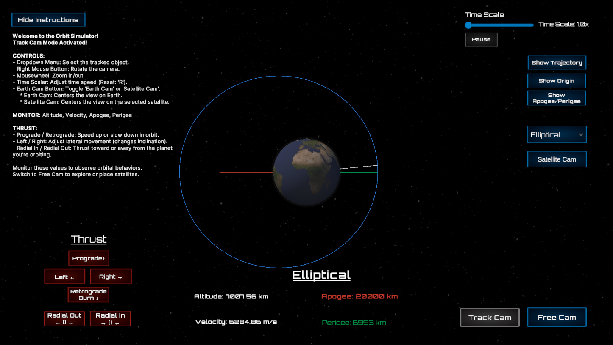
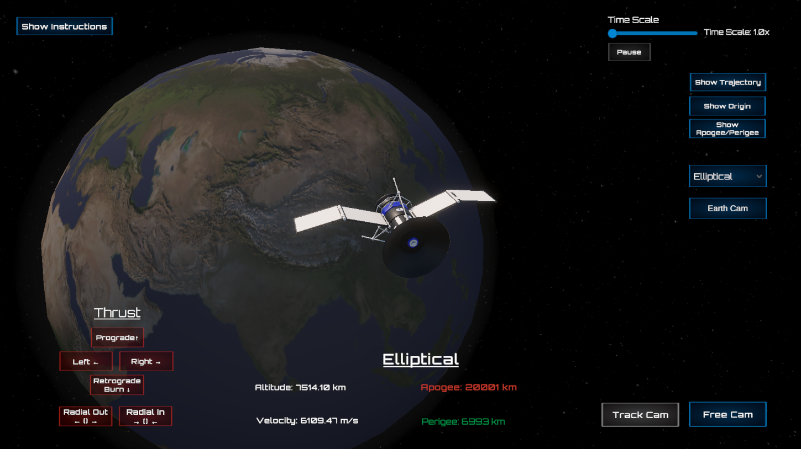
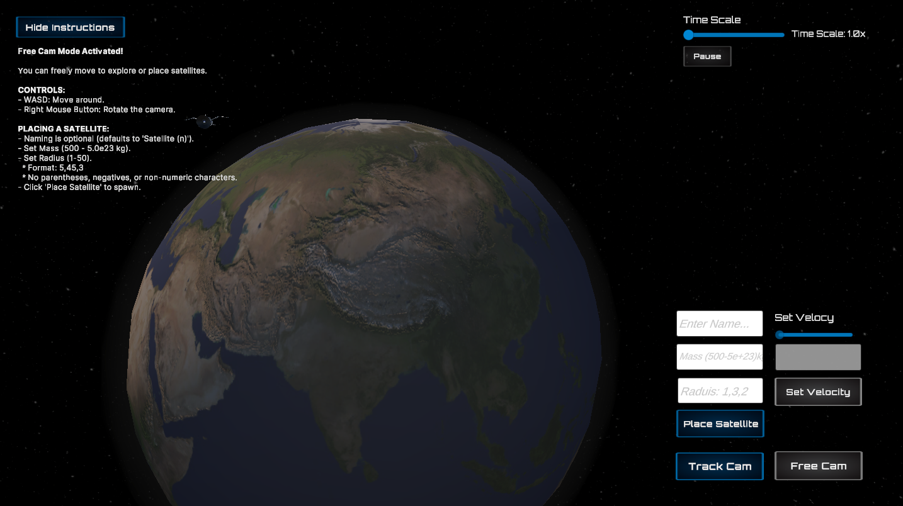

# Satellite Maneuver Simulator

A real-time orbital mechanics simulator built in **Unity** with core physics handled by a custom **C++ DLL**. This project demonstrates Newtonian N-body dynamics, RK4 integration, live thrust maneuvers, and GPU-rendered trajectories.

**Built from scratch to simulate realistic orbital mechanics in real time, no Unity physics used.**

[Watch the Demo Video](https://www.youtube.com/watch?v=aADKGJIdwKM) *Cntl-click to open in new tab*

---

## What This Is

This is a simulation prototype that allows:

- Runtime placement of satellites with mass, radius, starting velocity and direction
- Real-time thrust maneuvers: prograde, retrograde, radial, normal/anti-normal
- Live visualization of orbital trajectories with GPU acceleration
- Continuous tracking of apogee, perigee, velocity, and altitude
- Time scaling from 1x to 100x
- Two camera modes: Free and Track

The physics are offloaded to a native C++ library for improved performance, allowing Unity to focus on visualization and interaction.

---

## Why I Built This

After following real-world missions like SpaceX and exploring tools like GMAT, I wanted to build something hands-on that reflects actual orbital mechanics. This simulator became a space where I could:

- Implement numerical integration (RK4) from scratch
- Explore multi-body gravitational systems in real time
- Work with C++ and Unity interoperability (DLL calls)
- Optimize both simulation logic and rendering

It also served as a way to deepen my understanding of orbital maneuvering and physics systems that underpin spaceflight simulation.

---

## System Breakdown

- **Physics Core (C++):** RK4 integration and gravitational forces
- **Unity Frontend:** Object instantiation, camera controls, and trajectory visualization
- **Thrust Model:** Instantaneous velocity change based on direction and current mass
- **Trajectory Rendering:** GPU-drawn orbital paths for performance
- **Interop:** Unity uses `DllImport` to communicate with native physics functions

---

## Tools & Technologies

- Unity (C#)
- Native C++ DLL (Windows)
- RK4 Numerical Integration
- Manual N-body gravity implementation (no built-in physics engine)
- Real-time rendering via Unity’s LineRenderer and GPU instancing

---

Want the full physics and technical breakdown?  
[Read More →](./TECHNICAL_README.md)

---

*This project was designed as a technical demonstration of my abilities in simulation engineering, physics programming, and real-time system development.*

[⬆ Back to Top](#satellite-maneuver-simulator)
