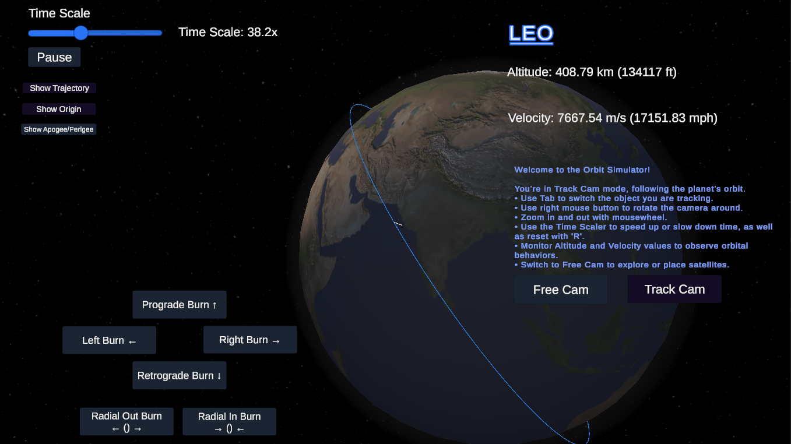
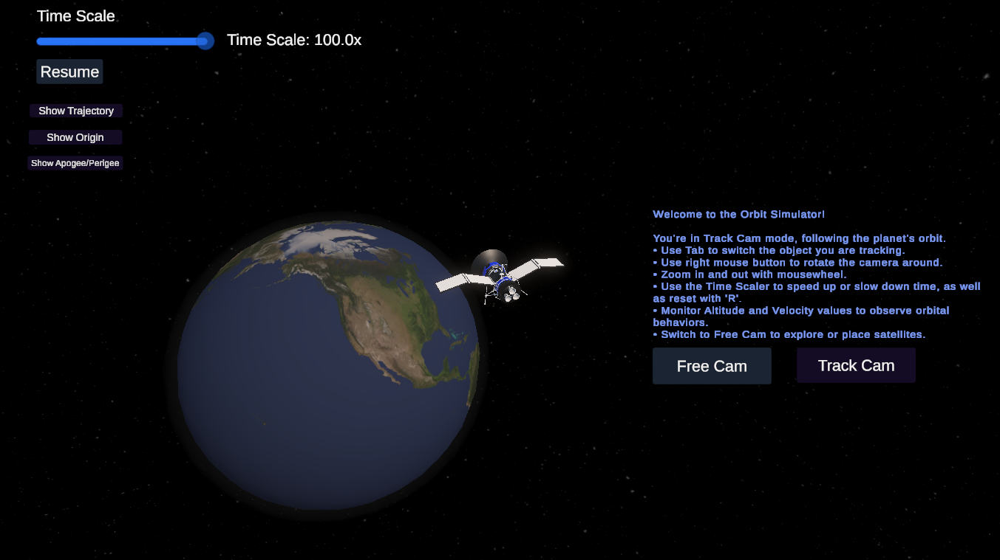

# Orbit Mechanics Simulator  

An interactive, real-time N-body orbital physics simulator built in Unity, featuring RK4 numerical integration, GPU-accelerated trajectory rendering, and real-time thrust mechanics.



_Current state of the simulation. Top image shows the Track cam with current object you are tracking, as well as velocity and altitude. The second image is Track cam up close showing the Satellite model. Work in progress._

## Table of Contents
- [Overview](#overview)
- [Key Features](#key-features)
- [How It Works](#how-it-works)
- [How to Use](#how-to-use)
- [Planned Features](#planned-features)
- [Limitations](#limitations)
- [Getting Started](#getting-started)
- [Technical Physics Breakdown](./Physics.md) *(separate file for RK4 and gravity calculations)*

---

## Overview
This project is a real-time orbital mechanics simulator that allows users to visualize, manipulate, and experiment with accurate gravitational physics. It includes fully interactive thrust mechanics, trajectory predictions, and scalable time controls to demonstrate how small adjustments affect long-term orbits.

Built in Unity, it leverages Runge-Kutta 4th Order (RK4) integration for accurate physics and GPU acceleration for smooth trajectory rendering.

---

## Key Features

### Full N-Body Orbital Simulation
- Each celestial body influences others using Newtonian gravity.
- Runge-Kutta 4th Order (RK4) integration ensures numerical stability over time.
- Earth remains stationary, but objects like the moon and satellites interact dynamically.

### Real-Time GPU-Accelerated Trajectory Rendering
- Trajectory visualization is handled on the GPU, reducing CPU overhead.
- Predicted orbits update dynamically based on real-time inputs.

### Interactive Thrust Mechanics
- Apply prograde, retrograde, radial, and lateral burns to modify orbits.
- Mass-based force scaling for realistic physics.

### Multiple Camera Modes
- Track Camera: Follows a selected celestial body with velocity and altitude readouts.
- Free Camera: Roam the scene, place new objects, and analyze trajectories.

### Time Control and Scaling
- Adjust time scale from real-time to 100x.
- Pause and resume simulation without resetting orbits.

### Advanced Orbital Interactions
- Computes apogee and perigee dynamically.
- Supports orbital decay, close encounters, and gravity assists.

---

## How It Works  
*(For in-depth equations and derivations, see [Physics.md](./Physics.md))*

### Numerical Integration (RK4)
- Uses Runge-Kutta 4th Order (RK4) instead of Euler for better stability.
- Computes position and velocity updates using four derivative calculations per step.
- Prevents numerical drift, keeping orbits stable over long simulations.

### Gravity Calculations
- Uses Newton’s Law of Gravitation to compute forces between all objects:
```
 F = G * (m1 * m2) / r^2 
```
- Avoids singularities by applying minimum distance thresholds.

### Real-Time Thrust Mechanics
- Thrust force applied relative to orbital velocity.
- Supports prograde/retrograde burns, radial adjustments, and lateral maneuvers.

---

## How to Use  

### Track Camera Mode
- Switch Tracked Object: Press `Tab` to cycle between orbiting bodies.
- Camera Controls: Right mouse button to rotate, scroll wheel to zoom.
- View Real-Time Data: Velocity (m/s and mph) and altitude (km and ft).

### Free Camera Mode
- Move with `WASD` or arrow keys, rotate with right-click, zoom with scroll wheel.
- Place New Planets: Set mass, radius, and velocity dynamically.

### Thrust Controls
- `Prograde Burn ↑` - Increase orbital speed.
- `Retrograde Burn ↓` - Decrease orbital speed.
- `Radial In/Out` - Modify altitude.
- `Lateral Burns` - Change inclination.

### Time Scaling
- Adjust with the slider (1x to 100x).
- Press `R` to reset time to normal speed.

---

## Planned Features  

- Maneuver Planning System - Pre-plan orbital burns similar to Kerbal Space Program.
- Full N-Body Simulation (Moving Earth) - Allow Earth to respond dynamically to forces.
- Barnes-Hut Optimization - Improve N-body calculations for better performance.
- Fuel System and Delta-V Calculations - Limit thrust by fuel mass, making burns more strategic.

---

## Limitations
- **No Aerodynamic Effects**: Currently, there’s no atmosphere or drag modeling.
- **No Relativistic Corrections**: Strictly Newtonian physics—relativistic effects are not accounted for.
- **Simplified Collisions**: Bodies are removed rather than merged; no physical collision response.
- **Prototype Thrust**: Thrust controls are still basic. More detailed burn planning is not yet implemented.

## Status

Visuals are still a work in progress, but the core physics engine is up and running. Updates will focus on polishing usability and expanding features like orbital maneuvers and collision realism.

## Getting Started

### Prerequisites

- **Unity:** Ensure you have Unity installed (version 2020.3 or later recommended).
- **Git:** For version control and cloning the repository.

### Installation

1. **Clone the Repository:**

- HTTPS:
  ```bash
  git clone https://github.com/Brprb08/space-orbit-simulation.git
  ```
- SSH:
  ```
  git clone git@github.com:Brprb08/space-orbit-simulation.git
  ```
- Github CLI:
  ```
  gh repo clone Brprb08/space-orbit-simulation
  ```

2. **Open in Unity:**

- Launch Unity Hub.
- Click on `Add` and navigate to the cloned repository folder.
- Open the project.

2. **Run the Simulation:**

- Open the `SampleScene.unity` file located in the `Assets/Scenes` directory.
- If no hierarchy or GameObjects are visible, ensure you have opened the correct scene by double-clicking `SampleScene.unity`.
- Click the `Play` button to start the simulation.

[⬆ Back to Top](#orbit-mechanics-simulator)
