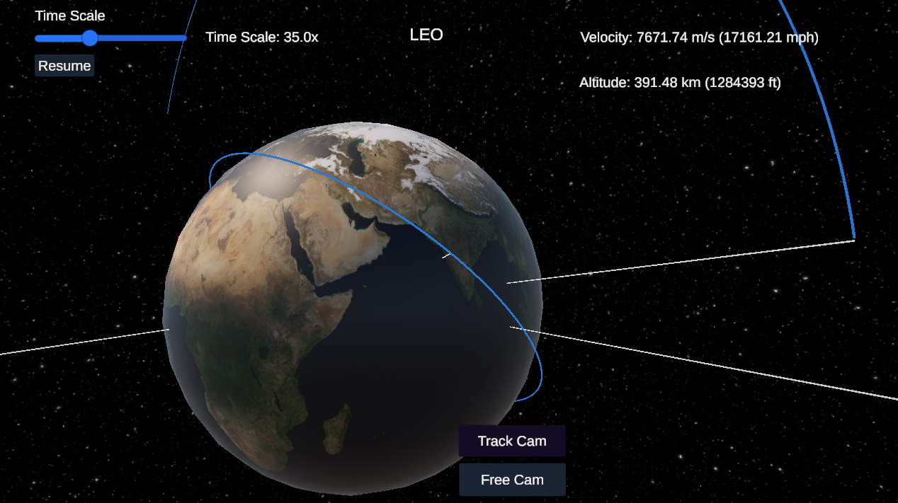

# Orbit Mechanics Simulator

*Current state of the simulation. This image shows the velocity and altitude of a satellite in an elliptical orbit. There is a time scale to increase simulation speed. Also, there is Track Cam to follow specific planets, and Free Cam to move around wherever. There is also a feature to place a satellite/planet as well as set the velocity. This adds the satellite to the sim in real time. More features to come soon. Work in progress.*

## Overview
This project is an interactive orbital mechanics simulator designed to allow users to visualize and interact with gravitational systems, simulate orbital trajectories, and experiment with creating celestial bodies with custom velocities and radii. It provides a simple interface for exploring the mechanics of gravity, planetary motion, and orbits.

## Current Features
- **Central Body Simulation:** Simulates a central body (e.g., Earth) with accurate rotation and gravitational properties.
- **Planet Placement:** Allows users to create planets with custom radii and positions in a free camera mode.
- **Velocity Setting:** Enables users to assign an initial velocity to newly placed planets, initiating their motion under the influence of gravity.
- **Trajectory Prediction:** Real-time rendering of predicted orbital paths for planets using the Runge-Kutta numerical integration method.
- **Collision Detection:** Detects and handles collisions between celestial bodies, including removal of smaller bodies upon impact.
- **Camera Modes:**
  - **Tracking Mode:** Automatically focuses on a selected celestial body, displaying real-time velocity and altitude.
  - **Free Camera Mode:** Allows free navigation and placement of new bodies in the system.
- **Time Control:** Adjustable simulation speed via a slider, supporting both slow-motion and time-lapse exploration.
- **Real-Time Feedback:** Displays velocity and altitude metrics for the selected body, ensuring an interactive learning experience.

## Limitations and Incomplete Features
- **No Thrust or Attitude Control:** The current implementation lacks the ability to apply thrust or control the orientation of celestial bodies.
- **Simplistic UI:** The user interface is minimal and lacks advanced feedback systems such as fuel tracking or burn planning.
- **Static Physics:** No advanced physics features like orbital decay, aerodynamic drag, or relativistic effects.
- **Collision Effects:** Collisions result in body removal but lack visual or physical effects like explosions or merging.

## How to Use
1. **Launch the Simulator:** Run the Unity application to start the simulation.
2. **Switch Camera Modes:**
   - Use tracking mode to follow a specific planet or free mode to navigate freely.
3. **Place New Planets:**
   - Enter a radius in the input field and click "Place Planet."
   - Assign velocity in the format `x,y,z` using the "Set Velocity" button.
4. **Observe Orbits:**
   - Watch the trajectories and metrics of planets as they interact with the central body.
   - Adjust the time scale to observe long-term dynamics or collision events.
5. **Remove or Re-assign Focus:**
   - Manually cancel placement or switch focus to another celestial body using the camera controls.

## Planned Updates
- **Thrust Mechanics:**
  - Add controls to apply thrust for orbital maneuvers and trajectory adjustments.
- **Improved UI:**
  - Create a more intuitive interface for body placement, orbit visualization, and feedback metrics.
- **Attitude Control:**
  - Enable rotation of celestial bodies for precise control of orbital dynamics.
- **Fuel Tracking:**
  - Introduce fuel consumption as a parameter for sustained maneuvers.
- **Advanced Collision Effects:**
  - Incorporate merging or fragmentation of celestial bodies on impact.
- **Additional Physics:**
  - Implement features like orbital decay and drag for enhanced realism.

## Status
The project is in its early stages. Key systems like gravitational dynamics and trajectory prediction are operational, but advanced features like thrust mechanics, drag effects, and fuel tracking are not yet implemented. Updates will focus on usability improvements, feature expansion, and enhanced visualization.
