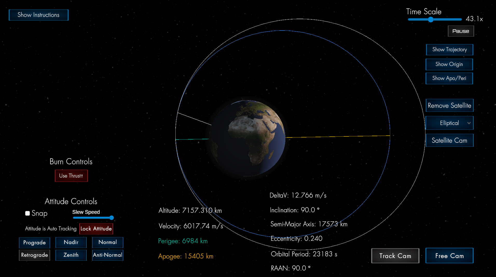
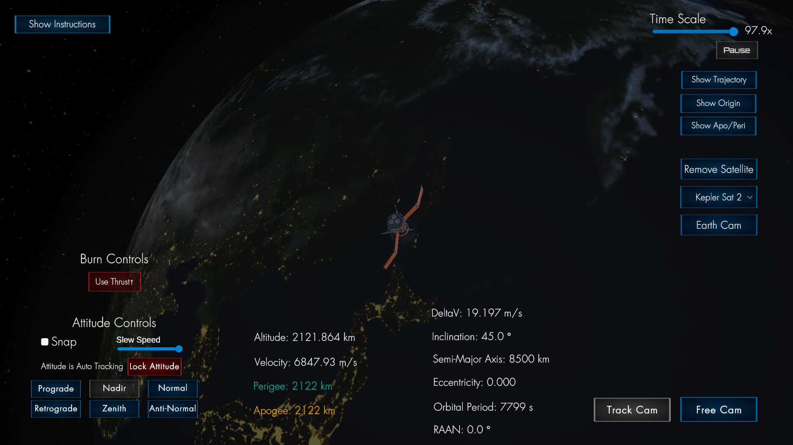
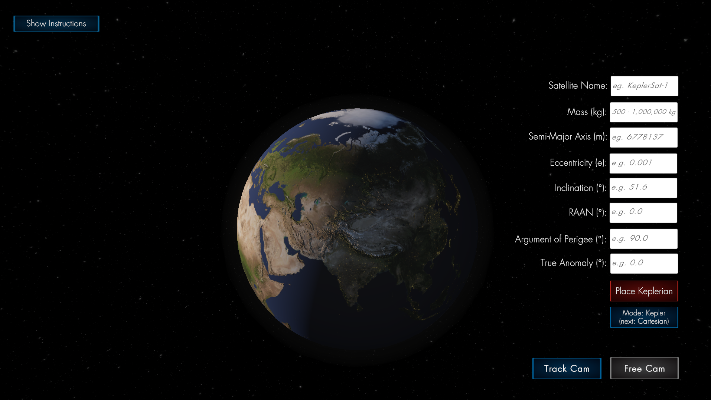

# Orbital Control Simulator

Drop in real satellite data, apply thrust, and watch orbital paths shift in real time. This isn’t just a visualization tool. It’s a physics-based simulator that runs a native integrator with GPU-predicted trajectories for precise orbital mechanics. Built in Unity using a custom double-precision C++ core, it handles orbital propagation, thrust, and drag completely outside Unity’s built-in physics.

[Watch the Demo Video on Youtube](https://www.youtube.com/watch?v=aisBrqQ_A4o&feature=youtu.be)




---

## Why I Built This

I got curious about orbital mechanics after watching a few SpaceX launches and wondering what really happens once the second stage reaches orbit, and how things like rendezvous or satellite parking actually work. I didn’t have a background in orbital dynamics or game development, but I did have one in computer science and wanted a project that would be a real challenge and strong enough to show in a portfolio.

It started as a simple scene with a few moving spheres, and eventually I was adding new features, fixing bugs, and improving performance to make it smoother and more fun to use. It turned into a great way to learn by building, figuring out how to simulate spacecraft motion while keeping everything running smoothly between Unity and the native C++ side. I just got addicted to working on it.

---

## Capabilities & Features

_All functionality runs live at runtime._

1. Live computation of orbital parameters: apogee, perigee, velocity, altitude, period, inclination, eccentricity, semi-major axis, RAAN
2. Real-time orbital decay using an atmospheric drag model
3. Thrust in the direction you’re pointing (prograde, retrograde, nadir/zenith, normal/antinormal)
4. **Attitude control system** with selectable pointing modes and smooth or snap slewing
5. GPU-predicted trajectories rendered with async RK4 integration (separate from the live sim)
6. Runtime placement of satellites with configurable mass, radius, velocity, and direction
   - **Cartesian Placement:** position + velocity vectors
   - **TLE Placement:** import real satellites via Two-Line Elements
   - **Keplerian Placement:** create orbits from classical elements (a, e, i, Ω, ω, ν)
7. Adjustable time scale from 1× to 100× for long-run propagation
8. Dual camera modes (free roam and tracking)

---

## Architecture Overview

- **Physics Core (C++ DLL):** Dormand–Prince 5(4) integrator, double-precision, real-time execution
- **Unity Frontend:** UI, scene management, camera controls, and GPU-based line rendering
- **Thrust Model:** Instantaneous impulse-based velocity change (scaled by body mass)
- **Interop Layer:** Unity communicates with the C++ backend via `DllImport`

---

## Interactive Tutorial

When you first press **Play** in Unity or run the built executable, an interactive tutorial automatically startsand takes you through the basics. Camera controls, satellite placement, and orbital maneuvers.

- **Starts automatically** on first launch
- **Fully interactive**: perform real actions to progress
- **Manual control**: use Next, Back, or Skip Tutorial anytime

**Sequence:**

- Learn camera controls and zoom with Track, Earth, and Free Cam
- Move freely with WASD and mouse look
- Place satellites by entering mass and radius and set velocity
- Adjust time scale
- Apply thrust to perform maneuvers

If you’d rather explore freely, just click Skip Tutorial when it appears.

---

## Unit Testing

**Total:** 50 Edit-Mode Tests **All Passing**  
**Framework:** Unity Test Framework (NUnit-style)  
**Type:** Edit-Mode (runs directly on compiled assemblies)

- **CameraCalculations** – Angle clamping, normalization, min/max distance logic
- **CameraController** – Mode switching (Track/Free/Earth), tracking bodies/placeholders
- **CameraMovement** – Target distance, EarthCam handling, movement state
- **NBody** – Initialization and central-body velocity reset
- **Orbital Calculations** – Apogee/perigee computation, orbital period, eccentricity
- **BodyService** – Register/deregister, central body events, satellite filtering
- **UIManager** – Mode-based UI states, EarthCam label updates, interactivity
- **ExtensionTests** – Vector3↔double3 conversions and precision checks
- **ParsingUtils** – String parsing, numeric extraction, TLE line validation
- **TLE Parser** – Field parsing, checksum validation, orbital element extraction

---

## How to Run

### Requirements

- Unity 2020.3 or later
- Windows 64-bit (required for native C++ DLL support)

### Run from the Unity Editor

1. Clone the repo:
   ```bash
   git clone https://github.com/Brprb08/space-orbit-simulation.git
   ```
2. Open the project in Unity Hub
3. Load the scene: `Assets/Scenes/OrbitSimulation.unity`
4. Press `Play` in the Unity Editor

The native physics backend is provided as a precompiled 64-bit DLL in `Assets/Plugins/x86_64/`.  
You do not need to compile the DLL yourself.

The following runtime dependencies are also included to support the C++ plugin:

- `libgcc_s_seh-1.dll`
- `libstdc++-6.dll`
- `libwinpthread-1.dll`

These are required on systems that do not have the GCC runtime installed.

### Build and Run (Standalone Executable)

To build and run the simulator as a standalone Windows application:

1. In Unity, open the menu:

   - File → Build Settings (or Build Profiles, depending on your version)

2. Select **Windows** as the target platform
3. Ensure the following settings:

   - **Architecture**: `Intel 64-bit`
   - **Build and Run on**: `Local Machine`
   - Make sure `Scenes/OrbitSimulation` is checked in the Scene List

4. Click **Build**, then select a folder to save the build output.
5. After the build completes, open the output folder and run the `SpaceOrbit.exe` file

All required DLLs (including the native physics plugin and its runtime dependencies) will be included automatically, as long as they are in `Assets/Plugins/x86_64/`.

---

[See Technical README →](./TECHNICAL_README.md)

---

_This project was designed as a technical demonstration of my abilities in simulation engineering, physics programming, and real-time system development._

[⬆ Back to Top](#orbital-control-simulator)
