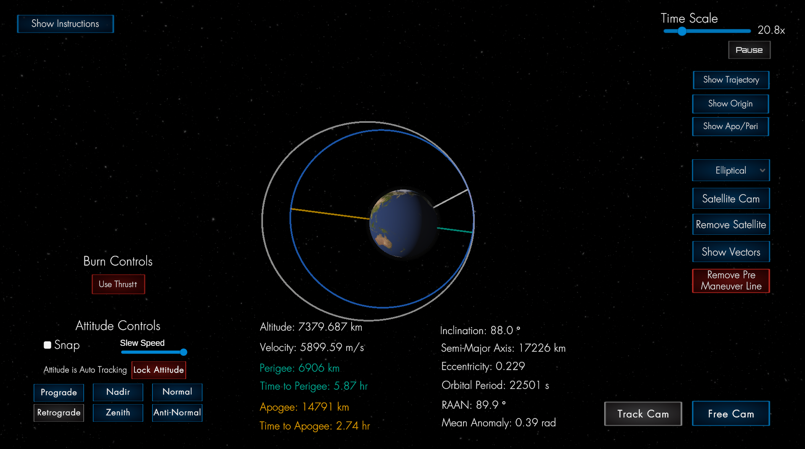
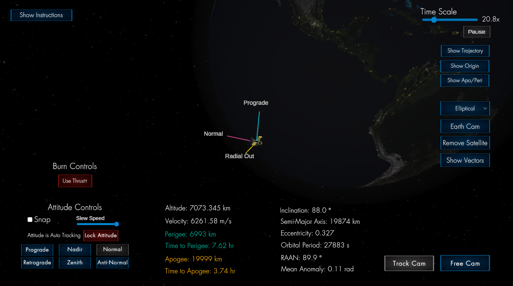
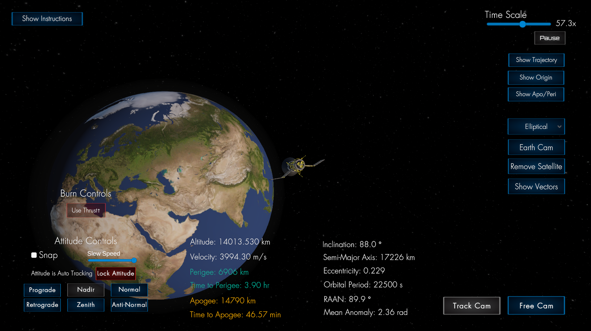
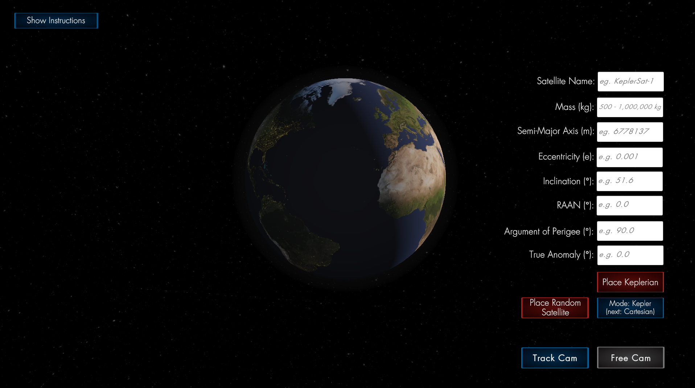

# Orbital Control Simulator

This is a real-time orbital mechanics simulator I built in Unity, with most of the physics handled in a native C++ backend. It started as a way to see if I could realistically simulate satellite motion, and gradually turned into a full real-time system with live thrust, drag, and orbital propagation.

You can load real TLE data, apply thrust, and immediately see how the trajectory responds. Unity handles visualization and camera controls, while the physics runs natively in C++ to keep things accurate and stable at runtime.

[Watch the Demo Video on Youtube](https://www.youtube.com/watch?v=aisBrqQ_A4o&feature=youtu.be)





---

## Why I Built This

I got interested in orbital mechanics after watching a few SpaceX launches and realizing I didn’t actually understand what happens once a rocket reaches orbit. Things like rendezvous, station keeping, maneuvers, or even maintaining a stable orbit were unknown to me, and I wanted to understand them in a more hands on way.

At the time, I didn’t have a background in orbital dynamics or game development. I did have a computer science background, and I was looking for a project that would force me to work with real physics and performance constraints instead of just writing another small application.

It started as a basic scene with a few objects moving under gravity. As I worked on it, I kept tightening the simulation and adding features as I improved. That gradually led to thrust modeling, attitude control, drag, better integration methods, and a lot of effort spent keeping everything stable and responsive at runtime.

---

## Capabilities & Features

_All functionality runs live at runtime._

- Continuous computation of orbital parameters such as apogee, perigee, altitude, velocity, inclination, eccentricity, period, and related quantities as the orbit evolves
- Orbital decay in low orbits using a simplified atmospheric drag model
- Thrust applied in the current pointing direction (prograde, retrograde, radial, and normal), taking effect immediately in the simulation
- Attitude control with selectable pointing modes, supporting both smooth slews and instant changes depending on use case
- GPU-based trajectory prediction using RK4 integration, run asynchronously from the main simulation so it doesn’t interfere with real-time behavior
- Runtime placement and resetting of satellites with configurable mass, size, velocity, and orientation  
  - **Cartesian placement:** direct position and velocity vectors  
  - **TLE placement:** import real satellites from Two-Line Element data  
  - **Keplerian placement:** initialize orbits from classical elements (a, e, i, Ω, ω, ν)  
  - **Randomized placement:** spawn objects into random orbits for quick testing
- Adjustable simulation time scale from 1× up to 100× for observing longer-term effects
- Two camera modes (free roam and target tracking), depending on whether you want to inspect the scene or follow a specific body
- Optional vector overlays for velocity, radial, and normal directions, rendered in world space with camera-facing labels and distance-based scaling to reduce visual clutter

---

## Architecture Notes

Physics and integration run in a native C++ DLL to avoid Unity’s single-precision limits and to keep numerical drift under control at higher time scales. Unity is used for visualization, input, and camera control, while trajectory previews are computed separately on the GPU so they don’t interfere with the main simulation. Communication between the two layers happens through a small interop layer using `DllImport`.

---

## Testing

The project includes a set of Unity edit-mode tests focused on areas where small mistakes would cause noticeable problems. Most of the tests cover orbital parameter calculations, camera behavior, TLE parsing, and object lifecycle handling, along with a few checks around precision and UI state.

The goal wasn’t exhaustive coverage, but catching regressions and making sure the core math and controls behaved consistently as the project grew.

---

## How to Run

### Requirements

- Unity 2020.3 or later
- Windows 64-bit (required for native C++ DLL support)

### Run from the Unity Editor

1. Clone the repo:
   ```bash
   git clone https://github.com/Brprb08/space-orbit-simulation.git
   ```
2. Open the project in Unity Hub
3. Load `Assets/Scenes/OrbitSimulation.unity`
4. Press `Play`

The physics backend is included as a precompiled 64-bit DLL in Assets/Plugins/x86_64/, so you don’t need to build it yourself.

A few runtime DLLs are included alongside it (libgcc, libstdc++, etc.) to avoid dependency issues on systems without a local GCC install.

### Standalone Build (Windows)

If you want to run it as a standalone app

1. Open build settings in Unity
2. Select **Windows** as the target platform (64 bit)
4. Make sure the `OrbitSimulation` scene is included
5. Build and run the generated executable

All required DLLs are included automatically, as long as they are in `Assets/Plugins/x86_64/`.

---

[⬆ Back to Top](#orbital-control-simulator)
