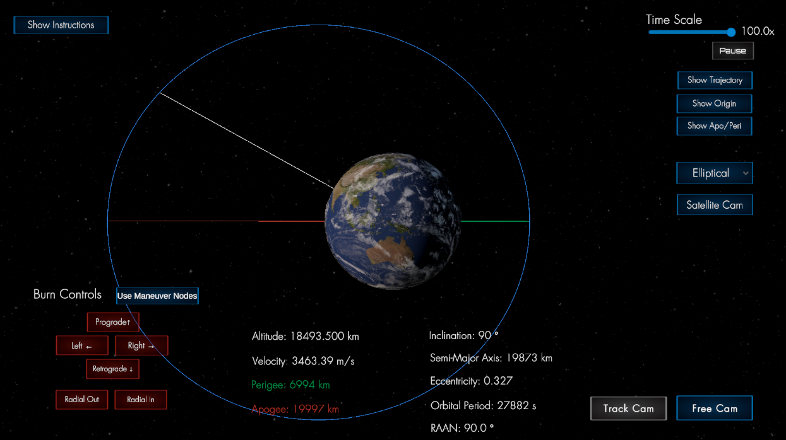
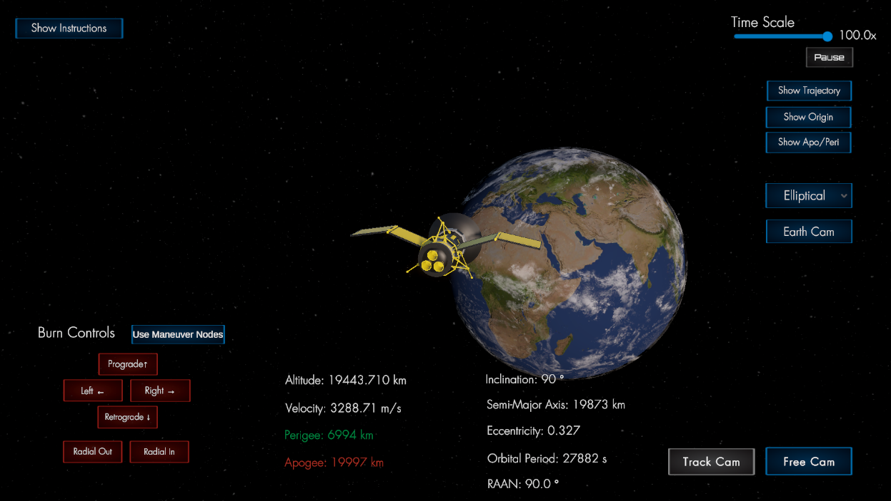
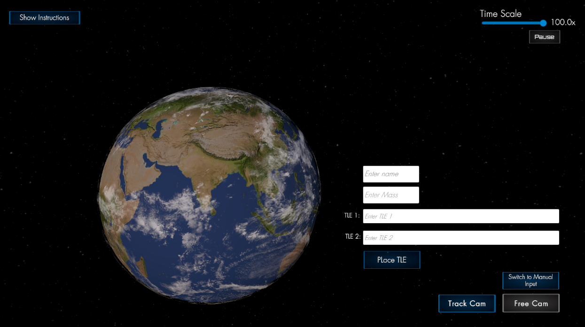

# Orbital Control Simulator

A real-time orbital mechanics sim built in Unity with a custom C++ physics backend. It models Newtonian orbital motion using a Dormand–Prince 5(4) integrator, supports live thrust, atmospheric drag, and visualizes full orbital paths with GPU-drawn trajectories.

**All orbital motion is handled externally using double-precision native code. Unity’s built-in physics system is not used.**

[🎥 Watch the Demo Video on Youtube](https://www.youtube.com/watch?v=aisBrqQ_A4o&feature=youtu.be)

---

## Why I Built This

I got interested in orbital mechanics after watching a few rocket launches and started digging into what actually happens after liftoff. I didn’t have a background in orbital physics or game development, so I used this project as a way to learn both. I wanted something that combined low-level systems, real-time performance, physics modeling, and 3D visualization. This led to me making a simulator that models real orbital behavior using a custom C++ physics engine, double-precision integration, and Unity-based rendering. The goal wasn’t just to visualize orbits. It was to understand and simulate them as accurately as possible.

---

## Capabilities & Features

- Runtime placement of satellites with mass, radius, velocity, and direction
- Add satellites at runtime via TLE input
- Instant thrust maneuvers in multiple directions (prograde, radial, normal, etc.)
- Real-time orbital decay via atmospheric drag modeling
- Continuously computes apogee, perigee, velocity, altitude, orbital period, inclination, eccentricity, semi-major axis, and RAAN
- Time scaling from 1x to 100x for long-term simulations
- GPU-predicted trajectories rendered using async RK4 integration (separate from live sim)
- Dual camera modes (free roam and tracking)
- Toggle between **Free Thrust** and early **Maneuver Node** system  
- In Node mode:
  - Select burn direction (prograde, retrograde, radial, normal, etc.)
  - Setup a maneuver node and adjust its orbital position
  - Auto-execute burns when the satellite reaches the node
  - See updated orbital paths post-burn with color-coded trajectories (gray = old, blue = new)

---

## Purpose

I built this to explore and implement orbital mechanics concepts in a real-time environment. It served as a way to:

- Deepen my understanding of spacecraft dynamics and numerical integration
- Implement numerical integration methods for stable, high-accuracy propagation
- Handle real-world perturbation forces like drag
- Work on interoperability between Unity and native C++ (via DLLs)
- Optimize rendering in a live physics environment

---

## Architecture Overview

- **Physics Core (C++ DLL):** Dormand–Prince 5(4) integrator, double-precision, real-time execution
- **Unity Frontend:** UI, scene management, camera controls, and GPU-based line rendering
- **Thrust Model:** Instantaneous impulse-based velocity change (scaled by body mass)
- **Atmospheric Drag:** Empirical model using interpolated density tables and cross-sectional area
- **Interop Layer:** Unity communicates with the C++ backend via `DllImport`

---

## Unit Testing

- Includes Editor Mode unit tests for utility logic
- All tests written in C# using Unity Test Framework
- 34/34 tests passing as of latest commit (TLE parsing, camera math, edge cases)
- Utility classes refactored for testability (static methods, no MonoBehaviours)

---

[See Technical README →](./TECHNICAL_README.md)

---

*This project was designed as a technical demonstration of my abilities in simulation engineering, physics programming, and real-time system development.*

[⬆ Back to Top](#orbital-control-simulator)
