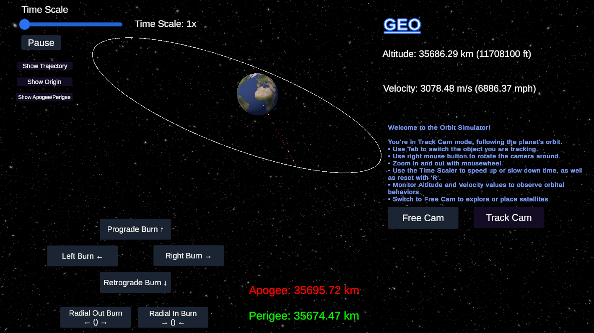

# Orbit Simulator



_Current state of the simulation. Top image shows the Track cam with current object you are tracking, as well as velocity and altitude. The second image shows Free Cam where you can move around wherever. Work in progress._

# Orbit Mechanics Simulator

An educational **orbital mechanics** simulator built in Unity, showcasing real-time gravitational interactions, trajectory predictions, and user-driven planetary placement. This project aims to provide a hands-on experience for space enthusiasts, students, and developers looking to explore the basics of orbital dynamics in a 3D, interactive environment.

---

## Table of Contents
- [Overview](#overview)
- [Key Features](#key-features)
- [Orbit Mechanics](#orbit-mechanics)
  - [Gravitational Interactions](#gravitational-interactions)
  - [Numerical Integration](#numerical-integration)
  - [Collision Handling](#collision-handling)
- [How to Use](#how-to-use)
  - [Track Camera Mode](#track-camera-mode)
  - [Free Camera Mode](#free-camera-mode)
  - [Time Control](#time-control)
  - [Placing New Celestial Bodies](#placing-new-celestial-bodies)
  - [Early Thrust Implementation](#early-thrust-implementation)
- [Planned Updates](#planned-updates)
- [Limitations](#limitations)
- [Getting Started](#getting-started)
  - [Prerequisites](#prerequisites)
  - [Installation](#installation)

---

## Overview
This project provides a **hands-on** approach to understanding orbital motion by allowing real-time manipulation of celestial bodies, time scaling, and initial velocities. It’s an ideal starting point for anyone curious about how gravity and orbital paths work—a useful stepping stone for more advanced space simulation topics.

---

## Key Features

1. **Central Body Rotation**  
   - A central body (e.g., Earth) remains in place but **rotates**, simulating real-world planetary spin.

2. **Custom Planet Placement**  
   - **Free Camera Mode**: Create planets on the fly, specifying their mass and radius.  
   - **Manual Velocity Assignment**: Use a slider or drag mechanics to set initial velocity vectors for newly placed bodies.

3. **Runge-Kutta Integration**  
   - Employs **RK4** for numerically stable and accurate orbital trajectory updates.

4. **Collision Detection & Removal**  
   - Automatically removes smaller bodies upon collision.  
   - If the tracked body is removed, the camera switches to the next available target or to Free Camera.

5. **Multiple Camera Modes**  
   - **Track Camera**: Follows a selected celestial body, with UI for velocity/altitude readouts.  
   - **Free Camera**: Roam freely to observe the entire scene and place new objects.

6. **Time Control**  
   - **Slider** for simulation speed (e.g., 1× to 100×).  
   - **Pause/Resume** with a button.  
   - **Reset** time scale by pressing **R**.

7. **Real-Time Feedback**  
   - **Velocity** displayed in m/s and mph.  
   - **Altitude** displayed in km and ft.  
   - **Apogee & Perigee** lines (and future expansions) visible for the tracked object.

8. **Interactive Thrust (Prototype)**  
   - Basic **prograde, retrograde, radial in/out, and lateral** thrust controls for the **tracked** body.  
   - Force is scaled by the object’s mass, altering orbits in real time.  
   - Allows users to experiment with orbital maneuvers at a fundamental level (e.g., quick burns to raise/lower altitude).

---

## Orbit Mechanics

### Gravitational Interactions
Uses Newton’s law of universal gravitation to compute forces between every pair of bodies. This allows for emergent orbital phenomena whenever a new body is introduced.

### Numerical Integration
Adopts **Runge-Kutta (RK4)** to accurately step positions and velocities through time. This approach keeps orbits stable and reduces numerical errors compared to simpler methods like Euler.

### Collision Handling
Bodies are approximated as spheres. When the distance between centers is less than the sum of radii, the smaller mass is removed. If it was being tracked, the camera automatically refocuses or reverts to Free Cam.

---

## How to Use

### Track Camera Mode
- **Select a Body**: Press **Tab** to cycle through existing bodies.
- **Camera Controls**: Right mouse button to rotate around the target; mouse wheel to zoom.
- **UI**: Displays the tracked body’s velocity (m/s and mph) and altitude (km and ft).

### Free Camera Mode
- **Navigation**: Use WASD/arrow keys to move; right mouse drag to rotate; mouse wheel to zoom.
- **Placement**: Allows real-time creation of new planets.

### Time Control
- **Slider**: Adjust the simulation speed from real-time up to high-speed time-lapse.
- **Pause/Resume**: Halt or restart the entire simulation at will.
- **Reset**: Press **R** to revert speed to the default.

### Placing New Celestial Bodies
1. **Enter Mass & Radius**: In the UI, specify the planet’s properties (1–500,000 kg mass, and any radius scale).
2. **Place Object**: Click **Place Planet** to instantiate a placeholder.
3. **Set Velocity**: Drag to form a velocity vector or enter numeric values directly. Click **Set Velocity** to finalize orbit insertion.

### Early Thrust Implementation
- Available **only** when a body is tracked (in Track Camera mode).
- **Prograde/Retrograde**: Increase or decrease orbital velocity along the current velocity vector.
- **Radial In/Out**: Burn toward or away from the planet’s center vector for orbital radius changes.
- **Lateral (Left/Right)**: Burn perpendicular to the orbit path, altering inclination or path shape.
- Thrust is **scaled by the object’s mass**, so heavier bodies require more force for the same effect.

---

## Planned Updates
- **Refined Thrust & Maneuvers**: Full orbital maneuver planning (e.g., circularization, transfer orbits, fuel usage).  
- **Advanced Collision Effects**: Beyond body removal—explosions, merging, or fragmentation.  
- **Extended Physics**: Potential orbital decay, aerodynamic drag, or relativistic effects for more realistic simulation.  
- **Attitude Control**: Orientation changes for satellites, with spin stabilization or reaction wheels.  
- **Polished UI & Camera Transitions**: Smoother camera modes, contextual menus for object selection.  
- **Fuel Tracking**: Monitor engine burn times and consumption for mission-like scenarios.

---

## Limitations
- **No Aerodynamic Effects**: Currently, there’s no atmosphere or drag modeling.
- **No Relativistic Corrections**: Strictly Newtonian physics—relativistic effects are not accounted for.
- **Simplified Collisions**: Bodies are removed rather than merged; no physical collision response.
- **Prototype Thrust**: Thrust controls are still basic. More detailed burn planning is not yet implemented.

## Status

The project is in its early stages. Key systems like gravitational dynamics and trajectory prediction are operational, but advanced features like thrust mechanics, drag effects, and fuel tracking are not yet implemented. Updates will focus on usability improvements, feature expansion, and enhanced visualization.

## Getting Started

### Prerequisites

- **Unity:** Ensure you have Unity installed (version 2020.3 or later recommended).
- **Git:** For version control and cloning the repository.

### Installation

1. **Clone the Repository:**

- HTTPS:
  ```bash
  git clone https://github.com/Brprb08/space-orbit-simulation.git
  ```
- SSH:
  ```
  git clone git@github.com:Brprb08/space-orbit-simulation.git
  ```
- Github CLI:
  ```
  gh repo clone Brprb08/space-orbit-simulation
  ```

2. **Open in Unity:**

- Launch Unity Hub.
- Click on `Add` and navigate to the cloned repository folder.
- Open the project.

2. **Run the Simulation:**

- Open the `SampleScene.unity` file located in the `Assets/Scenes` directory.
- If no hierarchy or GameObjects are visible, ensure you have opened the correct scene by double-clicking `SampleScene.unity`.
- Click the `Play` button to start the simulation.

[⬆ Back to Top](#orbit-simulator)
