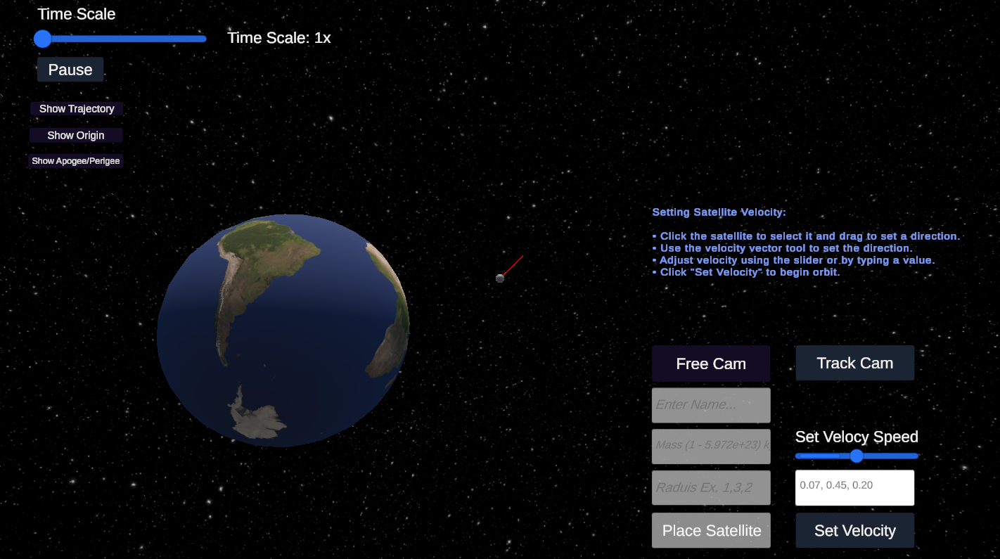

# Orbit Simulator



_Current state of the simulation. Top image shows the Track cam with current object you are tracking, as well as velocity and altitude. The second image shows Free Cam where you can move around wherever. Work in progress._

**Orbit Simulator** is an interactive orbital mechanics simulator developed using Unity. It allows users to visualize and interact with gravitational systems, simulate orbital trajectories, and experiment with creating celestial bodies with custom velocities and radii. The simulator provides a user-friendly interface for exploring the mechanics of gravity, planetary motion, and orbital dynamics.

## Table of Contents

- [Overview](#overview)
- [Current Features](#current-features)
- [Orbit Mechanics](#orbit-mechanics)
- [How to Use](#how-to-use)
- [Limitations and Incomplete Features](#limitations-and-incomplete-features)
- [Planned Updates](#planned-updates)
- [Getting Started](#getting-started)

## Overview

This project can be used as an educational tool for understanding orbital mechanics and gravitational interactions. By allowing users to place celestial bodies, assign velocities, and observe their interactions, the simulator provides a hands-on experience of how orbits are formed and maintained. If your a space enthusiast, this Orbit Simulatoin offers an engaging way to explore the complexities of orbital motion.

## Current Features

### 1. Central Body Simulation

- **Central Body (e.g., Earth):** Simulates a central celestial body with accurate rotation and gravitational properties.
- **Rotation:** The central body rotates to mimic real-world planetary rotation.

### 2. Planet Placement

- **Customizable Planets:** Users can create planets with custom radii, masses, and positions using the Free Camera mode.
- **Velocity Assignment:** Assign initial velocities to newly placed planets via drag-and-drop or slider controls to initiate their motion under gravity.
- **Real-Time Addition:** Newly placed planets are integrated into the simulation in real-time.

### 3. Trajectory Prediction

- **Runge-Kutta Integration:** Utilizes the Runge-Kutta (RK4) numerical integration method for accurate trajectory prediction.
- **Visual Trajectories:** Real-time rendering of predicted orbital paths using Line Renderers.

### 4. Collision Detection

- **Automatic Collision Handling:** Detects collisions between celestial bodies and removes the non-central body upon impact.
- **Dynamic Tracking:** If the tracked body is removed due to a collision, the camera automatically switches to the next available body or Free Camera mode.

### 5. Camera Modes

- **Tracking Mode:**
  - **Focus on Celestial Bodies:** Automatically follows a selected celestial body.
  - **UI Updates:** Displays real-time velocity and altitude of the tracked body.
  - **Controls:** Right mouse button to rotate around the target, mouse wheel to zoom in/out, and `Tab` key to switch between multiple tracked bodies.
- **Free Camera Mode:**
  - **Free Navigation:** Allows unrestricted movement and rotation within the simulation space.
  - **Object Placement:** Facilitates the placement of new celestial bodies without restrictions.
  - **Controls:** WASD or arrow keys for movement, right mouse button to rotate, and mouse wheel to zoom.

### 6. Time Control

- **Adjustable Time Scale:** Users can control the simulation speed using a slider, enabling both real-time and time-lapse observations.
- **Pause/Resume:** A pause button allows users to halt and resume the simulation at any time.
- **Reset Time Scale:** Pressing the `R` key resets the time scale to the default value.

### 7. Real-Time Feedback

- **Velocity Display:** Shows the current velocity of the tracked celestial body in meters per second (m/s) and miles per hour (mph).
- **Altitude Display:** Displays the altitude of the tracked body above the central body in kilometers (km) and feet (ft).
- **Object Name:** Continuously updates the name of the currently tracked celestial body.

## Orbit Mechanics

### Gravitational Interactions

The simulation calculates gravitational forces between celestial bodies using Newton's law of universal gravitation. Each `NBody` object interacts with every other `NBody` in the scene, resulting in realistic orbital paths based on their masses and distances.

### Numerical Integration

To predict and update the trajectories of celestial bodies, the simulator employs the Runge-Kutta (RK4) numerical integration method. This approach ensures accurate and stable calculations of positions and velocities over time, even in complex gravitational systems.

### Collision Handling

When two celestial bodies come into close proximity, the simulation detects a collision based on their radii. The body is automatically removed from the simulation, and if it was being tracked, the camera shifts focus to the next available body or switches to Free Camera mode.

### Trajectory Prediction

Using Line Renderers, the simulator visualizes the predicted paths of celestial bodies. These trajectories are dynamically updated to reflect changes in velocity or the addition of new bodies, providing users with real-time insights into future orbital behaviors.

### Central Body Rotation

The central celestial body (e.g., Earth) is programmed to rotate, simulating real-world planetary rotation. This rotation affects the orientation of the central body and can influence the perceived motion of orbiting bodies.

## How to Use

1. **Launch the Simulator:**

   - Run the Unity application to start the simulation.

2. **Switch Camera Modes:**

   - **Tracking Mode:** Follow a specific planet by selecting it. Use the right mouse button to rotate the camera around the planet and the mouse wheel to zoom.
   - **Free Camera Mode:** Switch to free navigation to explore the simulation space or place new celestial bodies.

3. **Place New Planets:**

   - **Enter Specifications:**
     - **Radius:** Input the desired radius for the planet in the format `x,y,z`.
     - **Mass:** Input the mass of the planet (1 to 500,000 kg).
     - **Name:** Optionally, assign a custom name to the planet.
   - **Initiate Placement:**
     - Click the "Place Planet" button to instantiate the planet in the simulation space.
   - **Set Velocity:**
     - Use the velocity drag tool to click and drag on the placed planet, setting its initial velocity vector.
     - Alternatively, adjust the velocity using the slider and confirm with the "Set Velocity" button.

4. **Observe Orbits:**

   - Watch the trajectories and metrics of planets as they interact with the central body.
   - Use the Time Control slider to adjust the simulation speed, observing long-term dynamics or collision events.

5. **Manage Focus:**
   - **Switch Focus:** Use the `Tab` key to cycle through available celestial bodies for tracking.
   - **Cancel Placement:** If needed, cancel the current placement to remove the placeholder and return to tracking mode.

## Limitations and Incomplete Features

- **Sun-Centered System Expansion:**
  - Expand the simulation to include a sun as the central body, allowing for more complex and larger-scale gravitational interactions typical of our solar system.
- **No Thrust or Attitude Control:** The current implementation lacks the ability to apply thrust or control the orientation of celestial bodies.
- **Simplistic UI:** The user interface is minimal and lacks advanced feedback systems such as fuel tracking or burn planning.
- **Static Physics:** No advanced physics features like orbital decay, aerodynamic drag, or relativistic effects.
- **Collision Effects:** Collisions result in body removal but lack visual or physical effects like explosions or merging.

## Planned Updates

- **Thrust Mechanics:**

  - Introduce controls to apply thrust for orbital maneuvers and trajectory adjustments.

- **Improved UI:**

  - Develop a more intuitive interface for body placement, orbit visualization, and comprehensive feedback metrics.

- **Attitude Control:**

  - Enable rotation and orientation control of celestial bodies for precise orbital dynamics.

- **Fuel Tracking:**

  - Incorporate fuel consumption as a parameter for sustained maneuvers and mission planning.

- **Advanced Collision Effects:**

  - Implement visual and physical effects such as explosions, merging, or fragmentation upon collisions.

- **Additional Physics:**
  - Enhance realism by adding features like orbital decay, aerodynamic drag, and potentially relativistic effects.

## Status

The project is in its early stages. Key systems like gravitational dynamics and trajectory prediction are operational, but advanced features like thrust mechanics, drag effects, and fuel tracking are not yet implemented. Updates will focus on usability improvements, feature expansion, and enhanced visualization.

## Getting Started

### Prerequisites

- **Unity:** Ensure you have Unity installed (version 2020.3 or later recommended).
- **Git:** For version control and cloning the repository.

### Installation

1. **Clone the Repository:**

- HTTPS:
  ```bash
  git clone https://github.com/Brprb08/space-orbit-simulation.git
  ```
- SSH:
  ```
  git clone git@github.com:Brprb08/space-orbit-simulation.git
  ```
- Github CLI:
  ```
  gh repo clone Brprb08/space-orbit-simulation
  ```

2. **Open in Unity:**

- Launch Unity Hub.
- Click on `Add` and navigate to the cloned repository folder.
- Open the project.

2. **Run the Simulation:**

- Open the `SampleScene.unity` file located in the `Assets/Scenes` directory.
- If no hierarchy or GameObjects are visible, ensure you have opened the correct scene by double-clicking `SampleScene.unity`.
- Click the `Play` button to start the simulation.

[⬆ Back to Top](#orbit-simulator)
